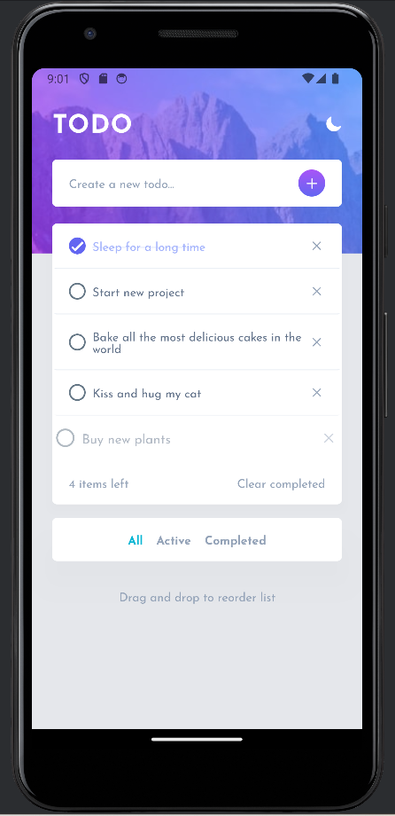
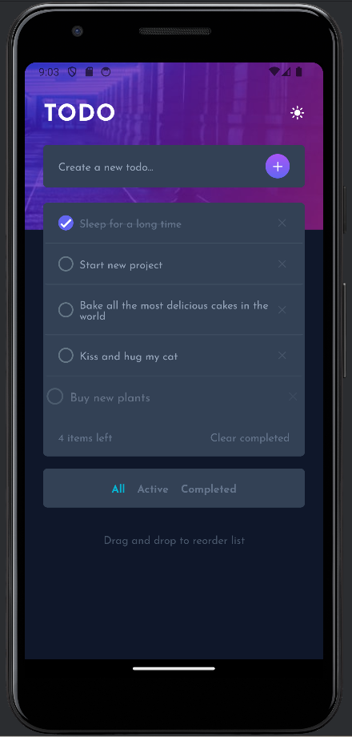

# Frontend Mentor - Todo app solution

## Bem-vindo(a)! 👋

Essa é a minha solução para o desafio [Todo app challenge on Frontend Mentor](https://www.frontendmentor.io/challenges/todo-app-Su1_KokOW). Esse desafio foi escolhido para praticar desenvolvimento Mobile, utilizando um projeto Expo + React Native + Native Wind. As maiores dificuldades foram por questão de configurações e bibliotecas inadequadas, mas foi um projeto fácil e relativamente rápido. Para a próxima etapa desse projeto, será desenvolvido uma API para persistência dos dados.

## Resumo geral do projeto

### O desafio

Os usuários devem ser capazes de:

- Marcar tarefas como concluídas
- Excluir tarefas da lista
- Filtrar por todas/as tarefas ativas/completas
- Limpar todas as tarefas concluídas
- Alternar entre os modos claro e escuro
- Arrastar e soltar para reordenar os itens na lista

### Execução do projeto

Para executar o projeto, você irá precisar clonar nesse projeto para sua máquina locamente e baixar todas as pendências do node `npm i`. Após isso, inicie o projeto com `npm start`.
Como um projeto Expo, você pode acessar ele de duas formas: Iniciando um projeto e abrindo no seu próprio celular, escaneando o QRCode no aplicativo do Expo, ou utilizando o emulador de sua preferência (o emulador utilizado foi o **Android Studio**).

## Processos de desenvolvimento

### Construído com as tecnologias:

- Expo
- React Native
- Typescript
- NativeWind

### O que eu aprendi:

- Utilizar a biblioteca de drag and drop do React. Foi uma ótima escolha para ter um primeiro contato com essa biblioteca e entender o seu funcionamento.
- Procurar novas abordagens e bibliotecas. Tive muitos problemas com algunas bibliotecas (um exemplo é a do Lucide React Native, que por algum motivo não consegui fazer funcionar) e tive que procurar outras abordagens. No final, tive que testar muitas abordagens diferentes e procurar novas soluções para resolver as dificuldades encontradas.

## Screenshots da versão final do projeto

### Versão Mobile Light Mode

### Versão Mobile Dark Mode

